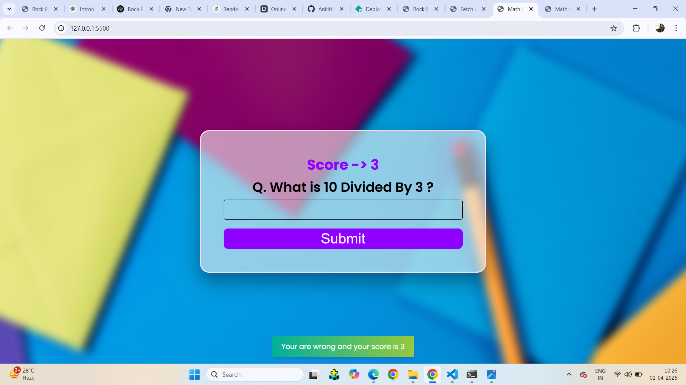
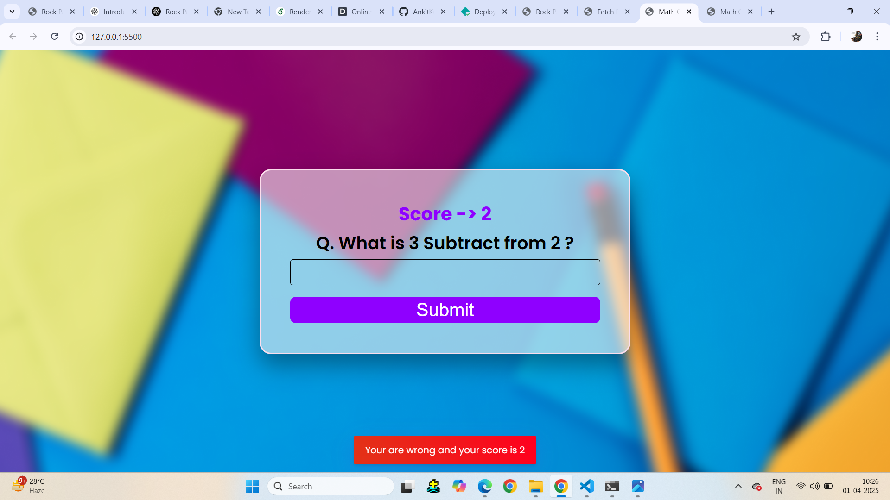

---
🧮 Math Quiz Game

🎮 Overview
The Math Quiz Game is an interactive and fun game designed to test and improve your math skills. It challenges players with randomly generated questions, keeping track of scores and response times. Perfect for students, teachers, and anyone who enjoys quick-thinking challenges!

🔹 Random math questions
🔹 Timed quiz mode
🔹 Score tracking system
🔹 User-friendly interface

📷 Project Images
🏠 Main Menu

🎯 Quiz in Action

🏆 Scoreboard

🚀 Features
✅ Different difficulty levels (Easy, Medium, Hard)
✅ Randomly generated math problems
✅ Timer-based challenge mode
✅ Live score tracking
✅ Interactive user interface

Copy
git clone https://github.com/yourusername/math-quiz-game.git

Open index.html in your browser

🎨 How to Play
1️⃣ Choose the difficulty level
2️⃣ Answer the randomly generated math questions
3️⃣ Each correct answer earns points
4️⃣ Complete the quiz before time runs out!
5️⃣ View your final score and try again to improve

🔧 Technologies Used

🎨 HTML & CSS &  JavaScript (for UI, if web-based)
🎲 Random Module (for generating quiz questions)

🤝 Contributing
Want to enhance the game? Follow these steps:

Fork the repository

Create a new branch

Make improvements (e.g., add new math categories, UI enhancements)

 for Images

